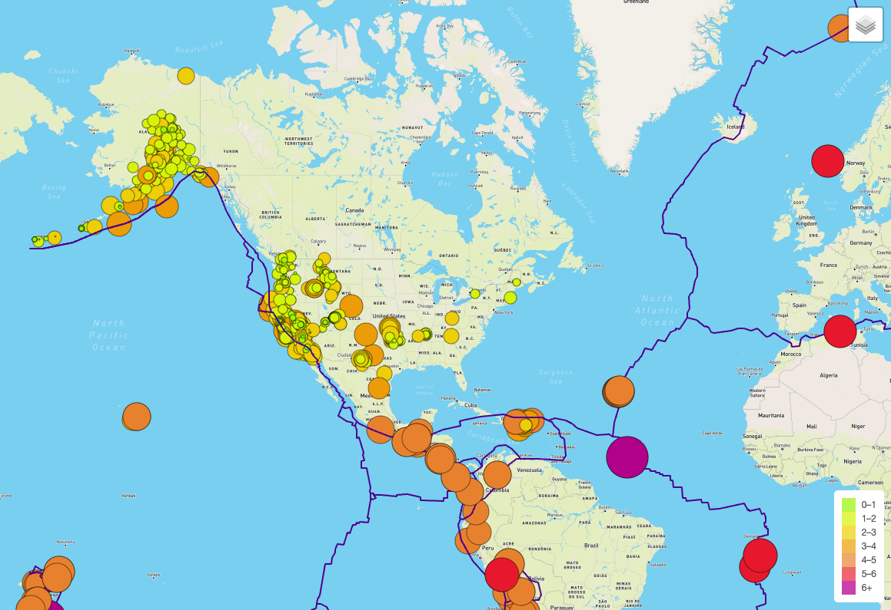
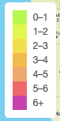
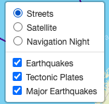
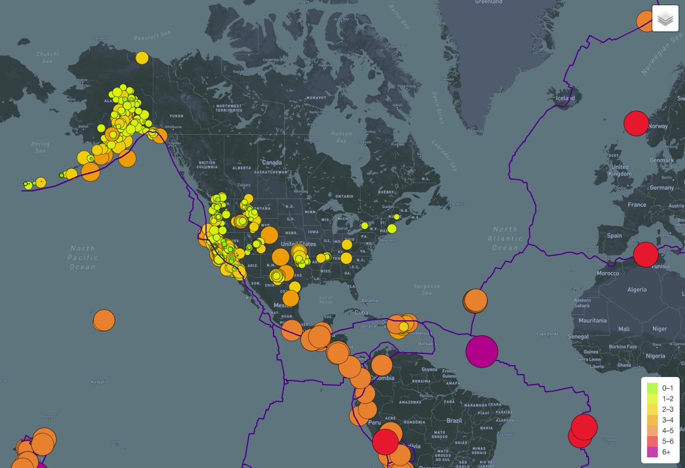

# Overview

The Purpose of this project was to design an interactive map displaying earthquake data from the past 7 days. The following technologies were leveraged:

- Leaflet
- MapBox
- D3

## Main Map View

## Legend
**Important Note**: To comply with deliverable concerning the mapping of "major earthquakes," the creative decision was made to add another color gradient representing magnitudes greater that 6.

## Map Options

## Third Map Layer - Navigation Night
